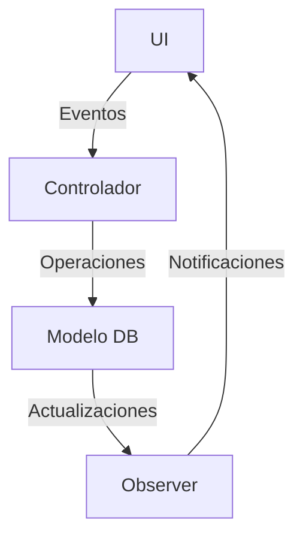

# Manual de Desarrollo Privado (MDP) - SIGESCON

## Índice
1. [Estructura del Proyecto](#estructura-del-proyecto)
2. [Arquitectura](#arquitectura)
3. [Base de Datos](#base-de-datos)
4. [Interfaz de Usuario](#interfaz-de-usuario)
5. [Lógica de Negocio](#lógica-de-negocio)
6. [Seguridad](#seguridad)
7. [Optimización](#optimización)
8. [Mantenimiento](#mantenimiento)

## Estructura del Proyecto

```
SIGESCON/
├── index.html              # Página principal
├── ayuda.html             # Documentación usuario
├── css/
│   ├── style.css         # Estilos generales
│   ├── ayuda.css         # Estilos ayuda
│   └── MDP.css           # Estilos documentación privada
├── js/
│   ├── script.js         # Lógica principal
│   ├── db.js            # Manejo de IndexedDB
│   ├── ui.js            # Componentes UI
│   ├── calculations.js  # Funciones de cálculo
│   ├── validations.js   # Validaciones
│   ├── exports.js       # Exportación de datos
│   └── MDP.js           # Lógica documentación privada
├── docs/
│   ├── MDP.md           # Este archivo
│   └── personal.md      # Documentación técnica general
└── assets/
    ├── images/          # Imágenes del proyecto
    └── icons/           # Iconos personalizados
```

## Arquitectura

### Patrones de Diseño
- **MVC (Modelo-Vista-Controlador)**
  - Modelo: IndexedDB (Dexie.js)
  - Vista: HTML/CSS
  - Controlador: JavaScript

- **Singleton**
  - Instancia única de la base de datos
  - Gestor de eventos globales

- **Observer**
  - Actualización de UI en tiempo real
  - Notificaciones de cambios

### Flujo de Datos


## Base de Datos

### Esquema IndexedDB

#### Tabla: Contratos
```javascript
{
    id: number,                    // Clave primaria
    numeroProveedor: string,       // Identificador único
    fechaFirma: Date,             // Fecha de firma
    fechaInicio: Date,            // Fecha de inicio
    fechaTerminacion: Date,       // Fecha de terminación
    montoTotal: number,           // Monto total del contrato
    estatus: string,              // Estado actual
    modalidad: string,            // Modalidad de contratación
    moneda: string,               // Tipo de moneda
    observaciones: string,        // Notas adicionales
    archivos: Array<File>,        // Archivos adjuntos
    fechaCreacion: Date,          // Fecha de creación
    fechaModificacion: Date,      // Última modificación
    usuarioCreacion: string,      // Usuario que creó
    usuarioModificacion: string   // Último usuario que modificó
}
```

#### Tabla: Partidas
```javascript
{
    id: number,                    // Clave primaria
    contratoId: number,           // Referencia a Contratos
    descripcion: string,          // Descripción detallada
    cantidad: number,             // Cantidad contratada
    umd: string,                  // Unidad de medida
    precioUnitario: number,       // Precio por unidad
    total: number,                // Total calculado
    fechaCreacion: Date,          // Fecha de creación
    fechaModificacion: Date       // Última modificación
}
```

#### Tabla: HES
```javascript
{
    id: number,                    // Clave primaria
    contratoId: number,           // Referencia a Contratos
    numeroHES: string,            // Número de HES
    fechaInicio: Date,            // Fecha de inicio
    fechaFinal: Date,             // Fecha final
    total: number,                // Monto total
    estatus: string,              // Estado actual
    aprobado: boolean,            // Estado de aprobación
    fechaAprobacion: Date,        // Fecha de aprobación
    archivos: Array<File>,        // Documentos adjuntos
    fechaCreacion: Date,          // Fecha de creación
    fechaModificacion: Date       // Última modificación
}
```

#### Tabla: PartidasHES
```javascript
{
    id: number,                    // Clave primaria
    hesId: number,                // Referencia a HES
    partidaId: number,            // Referencia a Partidas
    cantidadEjecutada: number,    // Cantidad ejecutada
    totalPartida: number,         // Total calculado
    fechaCreacion: Date,          // Fecha de creación
    fechaModificacion: Date       // Última modificación
}
```

### Índices y Relaciones
```javascript
// Índices principales
db.contratos.index('numeroProveedor');
db.contratos.index('estatus');
db.hes.index('contratoId');
db.partidas.index('contratoId');
db.partidasHES.index('hesId');
db.partidasHES.index('partidaId');

// Relaciones
db.contratos.hasMany('partidas');
db.contratos.hasMany('hes');
db.hes.hasMany('partidasHES');
db.partidas.hasMany('partidasHES');
```

## Interfaz de Usuario

### Componentes Principales

#### 1. Header
```html
<header class="header bg-light-blue">
    <div class="container-fluid">
        <div class="d-flex justify-content-between align-items-center py-3">
            <div class="logo d-flex align-items-center">
                <i class="fas fa-file-contract me-2"></i>
                <h1 class="mb-0">Gestión de Contratos Empresariales</h1>
            </div>
            <a href="ayuda.html" target="_blank" class="btn btn-primary help-btn">
                <i class="fas fa-question-circle me-2"></i> Ayuda
            </a>
        </div>
    </div>
</header>
```

#### 2. Sidebar
```html
<aside class="sidebar bg-dark-blue">
    <nav class="nav flex-column">
        <!-- Botones de navegación -->
    </nav>
</aside>
```

#### 3. Contenido Principal
```html
<main class="content">
    <section id="[section-id]" class="content-section">
        <!-- Contenido dinámico -->
    </section>
</main>
```

### Estilos CSS

#### Variables Globales
```css
:root {
    --primary-color: #4CAF50;
    --secondary-color: #2196F3;
    --accent-color: #FFC107;
    --danger-color: #F44336;
    --success-color: #4CAF50;
    --info-color: #03A9F4;
    --background-color: #f0f2f5;
    --card-background: #ffffff;
    --text-color: #333;
    --light-text-color: #666;
    --border-color: #ddd;
    --header-bg: #3f51b5;
}
```

#### Layout
```css
.main-container {
    display: grid;
    grid-template-columns: 250px 1fr;
    min-height: 100vh;
}

.content {
    padding: 20px;
    overflow-y: auto;
}
```

#### Componentes
```css
.card {
    background: var(--card-background);
    border-radius: 8px;
    box-shadow: 0 2px 4px rgba(0,0,0,0.1);
    padding: 20px;
    margin-bottom: 20px;
}

.table-responsive {
    overflow-x: auto;
    -webkit-overflow-scrolling: touch;
}
```

## Lógica de Negocio

### Gestión de Contratos

#### Creación de Contrato
```javascript
async function crearContrato(datos) {
    try {
        // Validaciones
        validarDatosContrato(datos);
        
        // Cálculos
        const montos = calcularMontosContrato(datos.partidas);
        
        // Creación en DB
        const contratoId = await db.contratos.add({
            ...datos,
            ...montos,
            fechaCreacion: new Date(),
            usuarioCreacion: obtenerUsuarioActual()
        });
        
        // Notificación
        mostrarNotificacion('Contrato creado exitosamente');
        
        return contratoId;
    } catch (error) {
        manejarError(error);
    }
}
```

#### Edición de Contrato
```javascript
async function editarContrato(id, datos) {
    try {
        // Validaciones
        validarDatosContrato(datos);
        
        // Actualización
        await db.contratos.update(id, {
            ...datos,
            fechaModificacion: new Date(),
            usuarioModificacion: obtenerUsuarioActual()
        });
        
        // Notificación
        mostrarNotificacion('Contrato actualizado exitosamente');
    } catch (error) {
        manejarError(error);
    }
}
```

### Gestión de HES

#### Creación de HES
```javascript
async function crearHES(datos) {
    try {
        // Validaciones
        validarDatosHES(datos);
        
        // Cálculos
        const montos = calcularMontosHES(datos.partidas);
        
        // Creación en DB
        const hesId = await db.hes.add({
            ...datos,
            ...montos,
            fechaCreacion: new Date()
        });
        
        // Actualización de avances
        await actualizarAvancesContrato(datos.contratoId);
        
        return hesId;
    } catch (error) {
        manejarError(error);
    }
}
```

### Cálculos

#### Avance Físico
```javascript
function calcularAvanceFisico(contratoId) {
    const partidas = await db.partidas
        .where('contratoId')
        .equals(contratoId)
        .toArray();
        
    const partidasHES = await db.partidasHES
        .where('partidaId')
        .anyOf(partidas.map(p => p.id))
        .toArray();
        
    return partidas.map(partida => {
        const ejecutado = partidasHES
            .filter(ph => ph.partidaId === partida.id)
            .reduce((sum, ph) => sum + ph.cantidadEjecutada, 0);
            
        return {
            partidaId: partida.id,
            avance: (ejecutado / partida.cantidad) * 100
        };
    });
}
```

#### Avance Financiero
```javascript
function calcularAvanceFinanciero(contratoId) {
    const contrato = await db.contratos.get(contratoId);
    const hes = await db.hes
        .where('contratoId')
        .equals(contratoId)
        .toArray();
        
    const totalEjecutado = hes.reduce((sum, h) => sum + h.total, 0);
    
    return {
        total: contrato.montoTotal,
        ejecutado: totalEjecutado,
        porcentaje: (totalEjecutado / contrato.montoTotal) * 100
    };
}
```

## Seguridad

### Validaciones

#### Datos de Contrato
```javascript
function validarDatosContrato(datos) {
    const errores = [];
    
    // Validación de fechas
    if (datos.fechaInicio >= datos.fechaTerminacion) {
        errores.push('La fecha de inicio debe ser anterior a la fecha de terminación');
    }
    
    // Validación de montos
    if (datos.montoTotal <= 0) {
        errores.push('El monto total debe ser mayor a cero');
    }
    
    // Validación de campos requeridos
    const camposRequeridos = ['numeroProveedor', 'fechaFirma', 'fechaInicio', 'fechaTerminacion'];
    camposRequeridos.forEach(campo => {
        if (!datos[campo]) {
            errores.push(`El campo ${campo} es requerido`);
        }
    });
    
    if (errores.length > 0) {
        throw new Error(errores.join('\n'));
    }
}
```

### Sanitización

#### Entradas de Usuario
```javascript
function sanitizarEntrada(texto) {
    return texto
        .replace(/[<>]/g, '') // Eliminar caracteres HTML
        .trim()               // Eliminar espacios
        .slice(0, 1000);      // Limitar longitud
}
```

## Optimización

### Caché

#### Datos Frecuentes
```javascript
const cache = {
    contratos: new Map(),
    hes: new Map(),
    
    async getContrato(id) {
        if (this.contratos.has(id)) {
            return this.contratos.get(id);
        }
        
        const contrato = await db.contratos.get(id);
        this.contratos.set(id, contrato);
        return contrato;
    }
};
```

### Rendimiento

#### Carga Lazy
```javascript
function cargarSeccion(id) {
    const seccion = document.getElementById(id);
    if (!seccion) return;
    
    // Cargar datos solo cuando la sección es visible
    const observer = new IntersectionObserver(entries => {
        entries.forEach(entry => {
            if (entry.isIntersecting) {
                cargarDatosSeccion(id);
                observer.unobserve(entry.target);
            }
        });
    });
    
    observer.observe(seccion);
}
```

## Mantenimiento

### Logs

#### Sistema de Logging
```javascript
const logger = {
    error: (mensaje, error) => {
        console.error(`[ERROR] ${mensaje}:`, error);
        // Guardar en IndexedDB
        db.logs.add({
            tipo: 'error',
            mensaje,
            error: error.toString(),
            fecha: new Date()
        });
    },
    
    info: (mensaje) => {
        console.info(`[INFO] ${mensaje}`);
        // Guardar en IndexedDB
        db.logs.add({
            tipo: 'info',
            mensaje,
            fecha: new Date()
        });
    }
};
```

### Backup

#### Exportación de Datos
```javascript
async function exportarBackup() {
    const datos = {
        contratos: await db.contratos.toArray(),
        partidas: await db.partidas.toArray(),
        hes: await db.hes.toArray(),
        partidasHES: await db.partidasHES.toArray()
    };
    
    const blob = new Blob([JSON.stringify(datos)], { type: 'application/json' });
    const url = URL.createObjectURL(blob);
    
    const a = document.createElement('a');
    a.href = url;
    a.download = `backup_${new Date().toISOString()}.json`;
    a.click();
    
    URL.revokeObjectURL(url);
}
```

### Actualizaciones

#### Migración de Datos
```javascript
async function migrarDatos(version) {
    const dbVersion = await db.version();
    
    if (dbVersion < version) {
        // Realizar migraciones necesarias
        await db.transaction('rw', db.contratos, db.partidas, async () => {
            // Actualizar esquema
            await db.contratos.toCollection().modify({
                // Nuevos campos
            });
        });
        
        // Actualizar versión
        await db.version(version);
    }
}
``` 